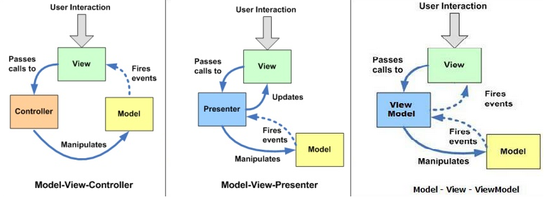

Pascals Lernjournal
===================
Pascal Honegger
Version 1.2, 07.11.2016
:toc:

== 27.09.2016
=== Xamarin
An sich ist das Konzept von Xamarin sehr ansprechend. Man schreibt einmal zentral C#-Code und definiert ein GUI via Xamarin Forms, und fertige Apps für iOS, Android und Windows Phone werden erstellt. Das Problem dabei ist nur, dass uns beim Entscheid die Applikation mit Xamarin umzusetzen nicht klar war, wie viele Probleme Xamarin mit sich bringt.
Das erste und lange andauernde Problem war die Installation. Nach dem Installieren von Xamarin wurden diverse Einstellungen und notwendige Software nicht immer installiert. Dies sorgte für sehr viele manuelle Xamarin-Reparaturen.
Auch gab es diverse Probleme beim Aufsetzen der Visual Studio Solution. So funktioniert der Build bei einigen Installation nicht, weil eine Nuget-Paket-Version falsch war. All diese Kleinigkeiten haben wir gehofft würden durch Martis Erfahrungen nicht auftreten, doch leider war dies nicht der Fall.
Alles in Allem würde ich nun ein weiteres Xamarin-Projekt starten. Dies aber nur, da ich nun nach stundenlangem Herumbasteln genug Erfahrungen gesammelt haben, um ein lauffähiges Projekt inklusive Installation innert Stunden und nicht Tagen erstellen kann.

== 04.10.2016
=== Skype Online-Meeting
Als Teil dieses Moduls haben wir als Team die Möglichkeit ein Scrum-Meeting in Form eines Online-Skype-Meetings umzusetzen.
Dabei ist mir direkt ein Problem mit unserem Plan aufgefallen: Weil wir unser Meeting erst nach 8 Uhr beginnen und jeder mindestens 30 Minuten Reisezeit zur Schule hat geht sehr viel Arbeitszeit verloren.
So konnten wir erst nach der 10 Uhr Pause mit der Arbeit beginnen. Dieser Zeitaufwand wurde in unserem Zeitplan unterschätzt.
Auch negativ waren die technischen Probleme wie Skype-Audio Probleme.
Sehr Positiv an dem Meeting war die Zusammenarbeit. Man hatte im Vergleich zum Schulzimmer eine bessere Möglichkeit sich auf das Meeting zu fokussieren. 
Auch sehr positiv war das Online-Scrum-Poker, welches das Schätzen der Stories enorm erleichtert hat.
Als Fazit finde ich die Zusammenarbeit via Skype sinnvoll, aber nur wenn dadurch keine Zeit verloren geht.
So hätte ich es sinnvoll gefunden den ganzen Morgen als Home-Office umzusetzen, dadurch hätten wir 45 Minuten Arbeitszeit gewonnen. 

=== MVVM vs MVC
==== Vergleich
In C# hat sich das link:https://de.wikipedia.org/wiki/Model_View_ViewModel[MVVM-Entwurfsmuster] als Standard durchgesetzt.
Der Vorteil dabei ist, dass die Logik (ViewModel) die Darstellung (View) nicht kennt. Das ViewModel stellt diverse Eigenschaften (Properties) zur Verfügung und die View greift auf diese zu, im Normalfall über ein sogenanntes Binding.
Bei einem Binding gibt man die zu verbindende Eigenschaft und weitere Informationen zum Verhalten des Bindings an.
Der entscheidende Unterschied zu MVC ist offensichtlich das ViewModel. Dieses bereitet die Daten des Models für die View auf. Die View verwendet dann diese aufbereiteten Daten und nicht die des Models. Das ViewModel informiert die View über Events (Oft link:https://msdn.microsoft.com/de-de/library/system.componentmodel.inotifypropertychanged(v=vs.110).aspx[INotifyPropertyChanged-Schnittstelle]), dass sich ein Wert verändert hat.
Auch informiert das Model das ViewModel über Änderungen der Daten, das ViewModel leitet diese Events falls nötig and die View weiter.

==== Eigenes kleines MVVM-Framework
Der Vorteil von MVVM ist in C# das WPF-Framework, welches das verbinden von View und ViewModel erleichtert. In Xamarin Forms gibts es zwar ähnliches, doch nicht so ausgereift. So war es nicht möglich ein Pop-Up auszulösen, ohne die View direkt zu kennen.
Um diese Abhängigkeit zwischen ViewModel und View zu eleminieren und den Code testbarer zu gestallten habe ich ein kleines Event-basiertes Pop-Up Framework erstellt. In der View kann dabei einfach gesagt werden, dass man gerne die Popups eines bestimmten ViewModel-Typen darstellen möchte. Die Instanz muss dabei nicht bekannt sein.
In dem ViewModel konnte über die ViewModelBase einfach eine PushDialog-Methode mit Parametern aufgerufen werden. Über ein Xamarin Event System wurde dann der entsprechende Event geworfen und von der View dargestellt.

=== FCoI ist wichtig
Ein sehr wichtiges Clean-Code-Developer Prinzip ist link:http://clean-code-developer.de/die-grade/roter-grad/#Favour_Composition_over_Inheritance_FCoI[Favour Composition over Inheritance (FCoI)].
In dem oben genannten MVVM-Framework habe ich ein konzeptuelles Problem begannen. Die Hilfsmethoden für das abonnieren von Events habe ich in einer PageBase-Klasse deponiert. Da alle unsere Fenster diese Hilfsmethoden benötigten mussten alle von dieser Hilfsklasse ableiten, somit wurde das Problem über Vererbung (Inheritance) gelöst.
Als dann Elia mit der Anfrage kam, diese Hilfsmethode in einer anderen Klasse zu verwenden, welche bereits eine Basisklasse hat, stand ich vor einem Problem.
Das Konzept an sich musste daher geändert werden. Dabei habe ich die Basisklasse entfernt und in eine statische Hilfsklasse umgewandelt, welche von den anderen über Aggregation verwendet werden konnte. Dadurch wurde dieses Stückchen code, welche keine Abhängigkeiten besitzt, isoliert und für alle verwendbar gestaltet.
Daraus habe ich gelern, dass ich Code welcher nicht zu etwas spezifischen gehört über Komposition verwenden sollte, wie das Prinzip besagt.

== 24.10.2016
=== Lose Kopplung zum Cloud Dienst -> Möglichst viel Komposition
Eine der Anforderungen ist die Erweiterbarkeit der Software im Bereich Dienste. Obwohl wir nur Dropbox unterstützen müssen muss der komplette Code mit Interfaces abgetrennt sein. 
Eine Weitere Massnahme um doppelten Code zu vermeiden ist das auslagern von Verantwortungen. So haben wir uns dafür entschieden, den Cloud-Dienst via Komposition zu verwenden.
Es gibt dann ein ViewModel welches für das Darstellen von Dateien verantwortlich ist. Dieses ViewModel ruft auf der via Komposition erhaltenen Instanz gewisse Methoden auf, um eine Liste mit dateien zu erhalten.
Dadurch erhoffen wir uns, dass der Code in den Cloud-Dienst-Implementation nur aus dem Aufrufen der Schnittstelle und dem erstellen der normalisierten Daten besteht.
Diese Architektur wurde als Konzept von mir erstellt, mündlich mit Alain und Seraphin besprochen und am Schluss im Team angenommen.

== 04.11.2016
=== Datenbankverbindungen sind böse
Beim Server lief zu Beginn alles gut. Innert kürzester Zeit konnten wir die Schnittstelle online erreichbar machen dank unseren Azure-Erfahrungen aus vorherigen Modulen (Chat). Erst nachdem die Clients genug fortgeschritten waren um den Server aktiv zu benutzen viele ein grosses Probleme auf: Der Server war nach einer gewissen Last nicht mehr erreichbar.
Der Fehler, welcher vom Server zurückgesendet wurde, sprach von zu vielen aktiven Datenbankanbindungen.
Da wir eine Datenbank benutzen wollten mussten wir eine Datenbankverbindung öffnen. Dabei habe ich einfach beim Start meines Services eine Verbindung geöffnet und diese beim schliessen des Services wieder beendet.
Nach einiger Recherche im Internet stiess ich jedoch darauf, dass man immer eine neue Verbindung öffnen und direkt wieder schliessen sollte, vorzugsweise mithilfe eines link:https://msdn.microsoft.com/en-us/library/yh598w02.aspx[Usings]. Dadurch verwaltet das .Net-Framework die offenen Verbindungen und nicht mehr unsere Applikation. Seit dieser Änderung hatte der Server keine Probleme mehr, was darauf hindeutet, dass dies auf jeden Fall die korrekte Art ist, eine Datenbankverbindung zu behandeln.

=== Statische Code Analysen und Code Metriken
Bei diesem Projekt war uns Code-Qualität sehr wichtig. Daher haben wir viel Aufwand in eine saubere Trennung von UI und Logik investiert, zusätzlich zu den Code-Reviews (Definitons of Done). Eine weitere Massnahme um die Code-Qualität zu verbessern ist das Einsetzen von Code Metriken.
Ich habe daher einen link:https://sonarqube.com/dashboard/index/Pascalhonegger%3APrettySecureCloud[SonarQube] aufgesetzt. Dieses Tool analysiert das Projekt und gibt feedback zu diversen statisch berechneten Werten.
So werden Komplexität, Wartbarkeit, Fehleranfälligkeit, Sicherheitsfehler, Code-Smells und noch mehr berechnet. Dabei interessiert und vor allem Code-Smells und die damit verbundenen Fehler.
Nach dem Aufsetzen und der ersten Analyse bekam unsere Solution eine schlechte Bewertung, da wir einen schweren Fehler hatten. Nach dem Korrigieren des Fehlers und der meisten angegebenen Warnungen verbesserte sich zum einen die Bewertung, aber viel Wichtiger verbesserte sich die Leserlichkeit und Fehleranfälligkeit unseres Codes.